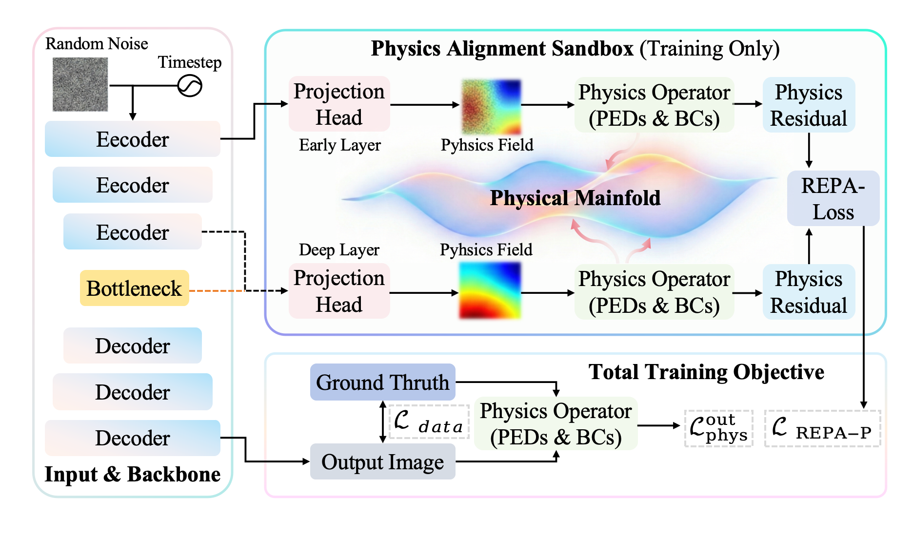

<h1 align="center">🌊 REPA-P for Physics-Informed Diffusion Models 🚀</h1>

<h4 align="center">✨ U-Net code for PIDM baseline and REPA-P ✨</h4>

$~$

## 🧩 Overview



## 📌 Introduction & Setup

This repository contains the U-Net implementation used in our REPA-P experiments, built on top of Physics-Informed Diffusion Models (PIDM).

### 🌟 Highlights

- 🔬 **Physics-informed diffusion**: train diffusion models with PDE residual guidance.
- 🧠 **REPA-P**: add projection heads to align intermediate representations with physical constraints.
- 🧱 **PIDM baseline included**: switch between PIDM and REPA-P from the same YAML file.
- 🌀 **Three benchmark systems**: Darcy flow, mechanics, and turbulent flow.
- 🛠️ **U-Net only**: clean release version without DiT code, datasets, or checkpoints.

Currently supported tasks:

- Darcy flow
- Topology optimization / mechanics
- Turbulent channel-flow slice

The charge / Poisson task is not included in this release.

The code supports both methods with the same training script:

```yaml
use_projection_heads: False  # PIDM baseline
use_projection_heads: True   # REPA-P
```

We provide two main scripts:

`main.py` trains the model. Change the dataset, run name, and projection-head switch in `model.yaml`, then run:

```bash
python main.py --config model.yaml --gpu XXX
```

`sample.py` evaluates trained models. It reads the saved `model.yaml` from the checkpoint folder, so the same script works for both PIDM and REPA-P:

```bash
python sample.py --name darcy.repap.unet --gpu XXX
```

## 📁 Data

Datasets and checkpoints are not included in this repository.

For the PIDM benchmark data used by the original Darcy flow and mechanics studies, download the data and pretrained models from the ETH Zurich Research Collection:

🔗 https://doi.org/10.3929/ethz-b-000674074

After downloading and unzipping the files, place the data under this repository as follows:

```text
.
├── data
│   ├── darcy
│   │   ├── train
│   │   │   ├── p_data.csv
│   │   │   └── K_data.csv
│   │   └── valid
│   │       ├── p_data.csv
│   │       └── K_data.csv
│   ├── mechanics
│   │   ├── train/fields
│   │   ├── test/valid/fields
│   │   ├── test/test_level_1/fields
│   │   ├── test/test_level_2/fields
│   │   └── solidspy_k_no_BC
│   └── ch_2Dxysec.pickle
└── trained_models
    └── ...
```

### 🌊 Darcy Flow

Use the Darcy flow data from the PIDM release. The training script expects:

```text
data/darcy/train/p_data.csv
data/darcy/train/K_data.csv
data/darcy/valid/p_data.csv
data/darcy/valid/K_data.csv
```

Then set:

```yaml
gov_eqs: darcy
```

### 🏗️ Mechanics

Use the topology optimization / mechanics data from the PIDM release. The training script expects:

```text
data/mechanics/train/fields/
data/mechanics/test/valid/fields/
data/mechanics/test/test_level_1/fields/
data/mechanics/test/test_level_2/fields/
data/mechanics/solidspy_k_no_BC/
```

Then set:

```yaml
gov_eqs: mechanics
```

### 🌀 Turbulent Flow

For turbulent flow, place the processed turbulent channel-flow pickle file here:

```text
data/ch_2Dxysec.pickle
```

The expected array layout is:

```text
[T, X, Y, C] = [10000, 128, 48, 1]
```

Then set:

```yaml
gov_eqs: turbulent
turbulent_data_path: ./data/ch_2Dxysec.pickle
```

## 🚀 How to Run

All settings are in `model.yaml`.

### 🎯 Choose one dataset

```yaml
gov_eqs: darcy       # darcy, mechanics, turbulent
```

### 🧪 Choose PIDM baseline

```yaml
run_name: darcy.pidm.unet
use_projection_heads: False
projection_positions: []
projection_hidden_dim: 0
c_projection: 0.0
```

### 🔥 Or choose REPA-P

```yaml
run_name: darcy.repap.unet
use_projection_heads: True
projection_positions:
  - decoder
projection_hidden_dim: 128
c_projection: 0.01
```

### 🏃 Train

```bash
python main.py --config model.yaml --gpu 0
```

📦 Training outputs are saved to:

```text
trained_models/<run_name>/
```

## ⚙️ Dataset Settings

Use these typical settings in `model.yaml`:

```yaml
# 🌊 Darcy
gov_eqs: darcy
train_iterations: 150000
train_batch_size: 64
c_ineq: 0.0
lambda_opt: 0.0
```

```yaml
# 🏗️ Mechanics
gov_eqs: mechanics
train_iterations: 300000
train_batch_size: 8
c_ineq: 0.001
lambda_opt: 0.1
```

```yaml
# 🌀 Turbulent
gov_eqs: turbulent
train_iterations: 150000
train_batch_size: 64
turbulent_data_path: ./data/ch_2Dxysec.pickle
```

## 📊 Evaluation

🔍 Evaluate the latest checkpoint:

```bash
python sample.py --name darcy.repap.unet --gpu XXX
```

🎯 Evaluate a specific checkpoint:

```bash
python sample.py --name darcy.repap.unet --step 150000 --gpu XXX --num-batches 4 --save-images
```

📁 Results are written to:

```text
trained_models/<run_name>/evaluation/step_<step>/
```

## 📦 Dependencies

Install dependencies with:

```bash
pip install -r requirements.txt
```

Main packages include `torch`, `numpy`, `pandas`, `matplotlib`, `tqdm`, `einops`, `torchvision`, `findiff`, `solidspy`, `scikit-image`, `pyyaml`, and `imageio`.


